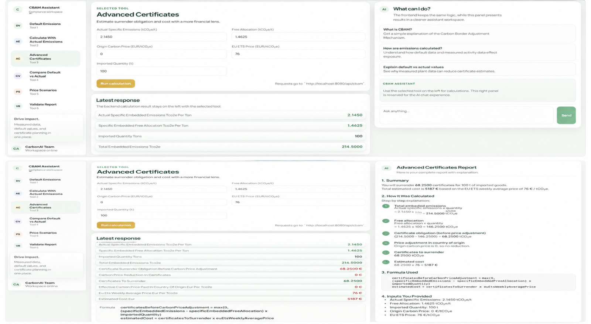

# CarbonAI TR - CBAM Calculator Engine

This module is a Spring Boot backend for deterministic CBAM calculations. It is designed for CarbonAI TR, where an AI or RAG layer may explain regulations and call backend tools, but the calculations themselves must stay deterministic, transparent, and auditable.

The backend does not use AI for any calculation.

This repository no longer ships a Spring-served frontend placeholder. The intended UI is a separate React application that calls this backend over HTTP.

## System overview

The project has three runtime parts:

- `backend/`: Spring Boot calculation engine. It performs deterministic CBAM calculations, validation, scenario analysis, and demo-data lookup.
- `frontend/`: React/Vite user interface. It calls backend endpoints over HTTP and can also call the agent service for conversational CBAM guidance.
- `agent_service/`: FastAPI + LangGraph agent service. It explains CBAM concepts, routes normal versus technical questions, retrieves RAG context, looks up CN codes/default values from CSV files, and explains backend formulas without executing calculations itself.

The image below shows the intended frontend format: calculator tools on the left, the selected calculation form and latest backend response in the center, and the CBAM assistant or generated explanation report on the right.



## Frontend integration

The React frontend is a separate app under `frontend/`. It is responsible for user interaction, forms, result display, CSV aggregation utilities, and calling HTTP APIs.

Typical frontend calls:

- Calls the Spring backend directly for deterministic calculator actions such as `/api/cbam/default-emissions`, `/api/cbam/actual-emissions`, `/api/cbam/scenarios`, and `/api/cbam/validate-report`.
- Calls the FastAPI agent service at `/api/chat` for natural-language CBAM support.
- Stores and resends the returned `thread_id` for follow-up chat messages.

The frontend should treat Spring calculation responses as the source of numerical truth. The agent response is explanatory: it can show formulas, describe the backend method, retrieve RAG snippets, and surface CN/default-value lookup results, but it should not be treated as a calculation executor.

## Agent service logic

Every `/api/chat` call in `agent_service/` follows this flow:

1. FastAPI receives `{ "message": "...", "thread_id": "..." }`.
2. If `thread_id` is missing, the service creates one and returns it with the answer.
3. `CBAMOrchestrator` routes the message:
   - normal chat goes to `NormalAgent`;
   - CBAM, CN-code, default-value, formula, reporting, or methodology questions go to the technical workflow.
4. `CBAMTaskGenerationAgent` extracts product name, CN code, year, country, export volume if present, and English RAG queries.
5. The workflow runs tool steps:
   - `product_cn_lookup` for product-description to CN-code matching;
   - `default_value_lookup` for CN-code/default-value details;
   - `rag_retrieval` for CBAM legal/guidance context;
   - `backend_calculation_explanation` for deterministic backend formulas and endpoint payload shapes.
6. `CBAMWriterAgent` writes the final answer using only task results and RAG excerpts.

Important agent boundaries:

- The agent does not perform arithmetic or submit official CBAM reports.
- The agent does not call backend calculation endpoints while answering chat.
- The agent can explain how the backend would calculate and which endpoint/payload would be used.
- The agent can return CN-code and default-value candidates from the CSV-backed lookup tool.

## What CBAM certificates are

CBAM certificates are units that EU importers or authorized CBAM declarants may need to buy and surrender to cover the embedded emissions of imported goods.

In simple words:

- A product has emissions attached to it.
- Those emissions can create a carbon-related obligation.
- CBAM certificates are the mechanism used to reflect that obligation.

This backend does not connect to the official EU registry and does not submit anything. It only performs calculations and validation checks.

## Why this is treated as financial exposure

Even though CBAM is not just a normal tax label, businesses often experience it as a cost exposure because:

- Higher embedded emissions can mean more certificates.
- More certificates can mean more EUR cost.
- Better actual emissions data can reduce estimated exposure compared with default values.

That is why this backend includes both emissions calculators and cost estimators.

## What this backend does

It exposes REST APIs for:

- Default-value emissions calculations
- Actual factory activity emissions calculations
- Simple carbon cost estimation
- Advanced certificate estimation
- Default-vs-actual cost comparison
- Carbon price scenario analysis
- CBAM-style report validation
- Demo data discovery

## Key CBAM concepts used in the code

- `tCO2e`: tonnes of CO2 equivalent
- `kgCO2e`: kilograms of CO2 equivalent
- `1 tCO2e = 1000 kgCO2e`
- Specific emissions: emissions per ton of product
- Embedded emissions: emissions associated with the traded goods
- Certificate price: EUR per tCO2e
- Export or import quantity: product amount in tons

## Calculation modes

### Default value mode

Use this when the exporter does not have actual factory emissions data.

The backend:

1. Finds a seeded default value by country and CN code.
2. Chooses the correct year-specific value.
3. Multiplies export volume by that default value.

Formula:

`embeddedEmissions = exportVolumeTons x defaultValueTco2ePerTon`

### Actual data mode

Use this when the exporter has actual factory activity data.

The source markdown used by this project treats embedded emissions as direct plus indirect emissions. The request field `includeIndirectEmissions` is kept only for backward compatibility and does not change the calculation.

The backend:

1. Looks up an emission factor for each activity.
2. Converts activity amounts into kgCO2e.
3. Converts kgCO2e into tCO2e.
4. Sums direct and indirect emissions.
5. Calculates specific emissions per ton.
6. Applies that intensity to the exported quantity.

Main formulas:

- `activityEmissionsKg = amount x factorKgCo2ePerUnit`
- `activityEmissionsTco2e = activityEmissionsKg / 1000`
- `specificEmissions = totalFacilityEmissions / productionVolumeTons`
- `exportedEmbeddedEmissions = specificEmissions x exportVolumeTons`

### Advanced certificate formula

Use this when more detailed inputs are available.

Definitions:

- `specificEmbeddedEmissions = actual specific embedded emissions`
- `specificEmbeddedFreeAllocation = SEFA-aligned free allocation adjustment`
- `importedQuantity = imported quantity`
- `effectiveCarbonPricePaidInCountryOfOrigin = carbon price effectively paid abroad`
- `euEtsWeeklyAveragePrice = ETS-linked CBAM certificate price`

Core formulas:

`certificatesBeforeCarbonPriceAdjustment = max(0, (specificEmbeddedEmissions - specificEmbeddedFreeAllocation) x importedQuantity)`

`carbonPriceReductionInCertificates = certificatesBeforeCarbonPriceAdjustment x effectiveCarbonPricePaidInCountryOfOrigin / euEtsWeeklyAveragePrice`

`certificatesToSurrender = max(0, certificatesBeforeCarbonPriceAdjustment - carbonPriceReductionInCertificates)`

`estimatedCostEur = certificatesToSurrender x euEtsWeeklyAveragePrice`

## Formula traceability

The table below records the exact Markdown source file used for each backend formula or formula family.

| Backend formula or situation | Exact source `.md` file(s) | Traceability note |
|---|---|---|
| `embeddedEmissions = exportVolumeTons x defaultValueTco2ePerTon` in default-value mode | `pdfs/outputs/raw_markdown/CELEX_32023R0956_EN_TXT.md` | Derived from the regulation definitions of `default value` and `embedded emissions`. The shipment multiplication is the backend's deterministic simplification for one exported batch. |
| Actual-data mode must include both direct and indirect emissions in embedded emissions totals | `pdfs/outputs/raw_markdown/CELEX_32023R0956_EN_TXT.md`, `pdfs/outputs/raw_markdown/TAXUD-2023-01189-01-00-EN-ORI-00.md` | Direct source for the definitions of `embedded emissions` and the guidance that both direct and indirect emissions are to be reported. |
| Actual-data mode electricity emissions use quantity x electricity emission factor | `pdfs/outputs/raw_markdown/TAXUD-2023-01189-01-00-EN-ORI-00.md` | The importer guidance explicitly says to report electricity quantities and multiply them by the relevant electricity emission factor. |
| Actual-data mode specific emissions = total emissions / production volume | `pdfs/outputs/raw_markdown/TAXUD-2023-01189-01-00-EN-ORI-00.md` | The guidance says attributed emissions are divided by the activity level to obtain specific embedded emissions. |
| Actual-data mode exported embedded emissions = specific emissions x exported quantity | `pdfs/outputs/raw_markdown/TAXUD-2023-01189-01-00-EN-ORI-00.md` | Derived from the guidance's specific-embedded-emissions-per-ton concept together with goods quantities used in reporting. |
| Use of actual data versus default values | `pdfs/outputs/raw_markdown/CBAM Frequently Asked Questions_November 2023.md` | Direct policy source explaining that actual embedded emissions are preferred and defaults are fallback or conditional. |
| Advanced-certificate free-allocation adjustment concept | `pdfs/outputs/raw_markdown/OJ_L_202502620_EN_TXT.md` | Main source for the 2026+ free allocation adjustment framework and benchmark-based adjustment logic. |
| Advanced-certificate carbon price deduction concept | `pdfs/outputs/raw_markdown/CBAM Frequently Asked Questions_November 2023.md`, `pdfs/outputs/raw_markdown/TAXUD-2023-01189-01-00-EN-ORI-00.md` | Source for the rule that the effective carbon price paid outside the EU reduces the CBAM obligation. |
| `/advanced-certificates` formula sequence | `pdfs/outputs/raw_markdown/OJ_L_202502620_EN_TXT.md`, `pdfs/outputs/raw_markdown/CBAM Frequently Asked Questions_November 2023.md`, `pdfs/outputs/raw_markdown/OJ_L_202502548_EN_TXT.md` | Project-level simplification derived from the free allocation adjustment framework, foreign-carbon-price deduction rule, and certificate pricing rules. It is not a verbatim legal equation. |
| Default-vs-actual comparison formula family | `pdfs/outputs/raw_markdown/CBAM Frequently Asked Questions_November 2023.md` | Project convenience calculation derived from the FAQ statement that actual values can lower the CBAM payment compared with default values. |
| Scenario analysis formula family | `pdfs/outputs/raw_markdown/OJ_L_202502548_EN_TXT.md` | Project convenience calculation derived from the official certificate price mechanism and multiple possible ETS-linked price points. |
| Report validation rule `total = direct + indirect` | `pdfs/outputs/raw_markdown/CELEX_32023R0956_EN_TXT.md`, `pdfs/outputs/raw_markdown/TAXUD-2023-01189-01-00-EN-ORI-00.md` | Derived from the legal definitions and importer guidance that embedded emissions reporting accounts for both direct and indirect emissions. |

## Seeded demo data

### Default values

- Country: `Turkey`
- CN Code: `25233000`
- Product: `Aluminous cement`
- Sector: `Cement`
- Direct default: `1.820 tCO2e/t`
- Indirect default: `0.140 tCO2e/t`
- Total default: `1.950 tCO2e/t`
- 2026 default with markup: `2.145 tCO2e/t`
- 2027 default with markup: `2.340 tCO2e/t`
- 2028 onwards default with markup: `2.535 tCO2e/t`

### Emission factors

The actual-emissions endpoint does not accept a simplified fixed enum such as
`NATURAL_GAS` or `ELECTRICITY`.

It performs an exact lookup against the CSV-backed factor repository using:

- `activityType`
- `unit`
- `year`

The safest way to discover supported values is to inspect `GET /api/cbam/demo-data`.

Examples that match the current repository data and tests:

- `Natural gas`: unit `t`, factor `2692.8 kgCO2e/t`, derived from `emission_tables_csv/table_1_fuel_emission_factors.csv`
- `Gas/Diesel oil`: unit `t`, factor `3186.3 kgCO2e/t`, derived from `emission_tables_csv/table_1_fuel_emission_factors.csv`

### Demo carbon prices

- `76`
- `100`
- `120`

## Demo scenario

A Turkish cement exporter ships `100` tons of aluminous cement to Germany in `2026` and does not have actual factory emissions data.

The backend:

1. Finds the seeded Turkey + `25233000` record.
2. Chooses the `2026` default value with markup: `2.145 tCO2e/t`.
3. Calculates embedded emissions:

`100 x 2.145 = 214.5 tCO2e`

4. If the price is `76 EUR/tCO2e`, it estimates financial exposure:

`214.5 x 76 = 16,302 EUR`

This is why the system treats CBAM as a financial exposure tool as well as an emissions calculator.

## Endpoints

- `POST /api/cbam/default-emissions`
- `POST /api/cbam/actual-emissions`
- `POST /api/cbam/advanced-certificates`
- `POST /api/cbam/compare-default-vs-actual`
- `POST /api/cbam/scenarios`
- `POST /api/cbam/validate-report`
- `GET /api/cbam/demo-data`

Swagger UI:

- `http://localhost:8080/swagger-ui.html`

OpenAPI JSON:

- `http://localhost:8080/v3/api-docs`

React integration contract:

- See [FRONTEND_API_CONTRACT.md](C:/Users/anisa/btk-google-hackathon/backend/FRONTEND_API_CONTRACT.md)

## Endpoint examples

### 1. Default emissions

```bash
curl -X POST http://localhost:8080/api/cbam/default-emissions \
  -H "Content-Type: application/json" \
  -d '{
    "country": "Turkey",
    "cnCode": "25233000",
    "year": 2026,
    "exportVolumeTons": 100
  }'
```

Response:

```json
{
  "country": "Turkey",
  "cnCode": "25233000",
  "productDescription": "Aluminous cement",
  "year": 2026,
  "exportVolumeTons": 100,
  "selectedDefaultValueTco2ePerTon": 2.1450,
  "embeddedEmissionsTco2e": 214.5000,
  "calculationMode": "DEFAULT_VALUE",
  "formula": "embeddedEmissions = exportVolumeTons x defaultValueTco2ePerTon"
}
```

### 2. Actual emissions

```bash
curl -X POST http://localhost:8080/api/cbam/actual-emissions \
  -H "Content-Type: application/json" \
  -d '{
    "cnCode": "72142000",
    "country": "Turkey",
    "year": 2026,
    "productionVolumeTons": 100,
    "exportVolumeTons": 40,
    "includeIndirectEmissions": true,
    "activities": [
      { "activityType": "Natural gas", "amount": 50, "unit": "t" },
      { "activityType": "Gas/Diesel oil", "amount": 5, "unit": "t" }
    ]
  }'
```

Response:

```json
{
  "cnCode": "72142000",
  "country": "Turkey",
  "year": 2026,
  "productionVolumeTons": 100,
  "exportVolumeTons": 40,
  "directEmissionsTco2e": 150.5715,
  "indirectEmissionsTco2e": 0.0000,
  "totalFacilityEmissionsTco2e": 150.5715,
  "specificEmissionsTco2ePerTon": 1.5057,
  "exportedEmbeddedEmissionsTco2e": 60.2286,
  "includeIndirectEmissions": true,
  "calculationMode": "ACTUAL_DATA",
  "activityBreakdown": [
    {
      "activityType": "Natural gas",
      "amount": 50,
      "unit": "t",
      "factor": 2692.8,
      "factorUnit": "kgCO2e/t",
      "emissionsTco2e": 134.6400,
      "emissionCategory": "DIRECT"
    },
    {
      "activityType": "Gas/Diesel oil",
      "amount": 5,
      "unit": "t",
      "factor": 3186.3,
      "factorUnit": "kgCO2e/t",
      "emissionsTco2e": 15.9315,
      "emissionCategory": "DIRECT"
    }
  ],
  "warnings": []
}
```

### 3. Advanced certificates

```bash
curl -X POST http://localhost:8080/api/cbam/advanced-certificates \
  -H "Content-Type: application/json" \
  -d '{
    "actualSpecificEmbeddedEmissionsTco2ePerTon": 2.145,
    "specificEmbeddedFreeAllocationTco2ePerTon": 1.4625,
    "effectiveCarbonPricePaidInCountryOfOriginEurPerTco2e": 0,
    "euEtsWeeklyAveragePriceEurPerTco2e": 76,
    "importedQuantityTons": 100
  }'
```

Response:

```json
{
  "actualSpecificEmbeddedEmissionsTco2ePerTon": 2.1450,
  "specificEmbeddedFreeAllocationTco2ePerTon": 1.4625,
  "importedQuantityTons": 100,
  "totalEmbeddedEmissionsTco2e": 214.5000,
  "certificateSurrenderObligationBeforeCarbonPriceAdjustment": 68.2500,
  "carbonPriceReductionInCertificates": 0.0000,
  "certificatesToSurrender": 68.2500,
  "effectiveCarbonPricePaidInCountryOfOriginEurPerTco2e": 0,
  "euEtsWeeklyAveragePriceEurPerTco2e": 76,
  "estimatedCostEur": 5187.00,
  "formula": "certificatesBeforeCarbonPriceAdjustment = max(0, (specificEmbeddedEmissions - specificEmbeddedFreeAllocation) x importedQuantity); carbonPriceReductionInCertificates = certificatesBeforeCarbonPriceAdjustment x effectiveCarbonPricePaidInCountryOfOrigin / euEtsWeeklyAveragePrice; certificatesToSurrender = max(0, certificatesBeforeCarbonPriceAdjustment - carbonPriceReductionInCertificates)"
}
```

### 4. Compare default vs actual

```bash
curl -X POST http://localhost:8080/api/cbam/compare-default-vs-actual \
  -H "Content-Type: application/json" \
  -d '{
    "defaultSpecificEmbeddedEmissionsTco2ePerTon": 2.145,
    "actualSpecificEmbeddedEmissionsTco2ePerTon": 1.6,
    "exportVolumeTons": 100,
    "euEtsWeeklyAveragePriceEurPerTco2e": 76
  }'
```

Response:

```json
{
  "defaultCostEur": 16302.00,
  "actualCostEur": 12160.00,
  "potentialSavingsEur": 4142.00,
  "savingsPercent": 25.41,
  "message": "Using actual embedded emissions instead of default values may reduce ETS-linked CBAM certificate cost exposure."
}
```

### 5. Scenario analysis

```bash
curl -X POST http://localhost:8080/api/cbam/scenarios \
  -H "Content-Type: application/json" \
  -d '{
    "embeddedEmissionsTco2e": 214.5,
    "euEtsWeeklyAveragePricesEurPerTco2e": [76, 100, 120]
  }'
```

Response:

```json
{
  "embeddedEmissionsTco2e": 214.5000,
  "scenarios": [
    {
      "euEtsWeeklyAveragePriceEurPerTco2e": 76,
      "estimatedCostEur": 16302.00
    },
    {
      "euEtsWeeklyAveragePriceEurPerTco2e": 100,
      "estimatedCostEur": 21450.00
    },
    {
      "euEtsWeeklyAveragePriceEurPerTco2e": 120,
      "estimatedCostEur": 25740.00
    }
  ]
}
```

### 6. Validate report

```bash
curl -X POST http://localhost:8080/api/cbam/validate-report \
  -H "Content-Type: application/json" \
  -d '{
    "goodsItemNumber": "1",
    "sequenceNumber": "1",
    "cnCode": "25233000",
    "country": "Turkey",
    "period": "2026",
    "directEmissionsTco2e": 1.82,
    "indirectEmissionsTco2e": 0.14,
    "totalEmissionsTco2e": 1.96,
    "netMassTons": 100
  }'
```

Valid response:

```json
{
  "valid": true,
  "errors": [],
  "warnings": []
}
```

Invalid response example:

```json
{
  "valid": false,
  "errors": [
    {
      "code": "R0010",
      "message": "Total emissions must equal direct emissions plus indirect emissions.",
      "expectedValue": 1.9600,
      "actualValue": 1.9500
    }
  ],
  "warnings": []
}
```

### 7. Demo data

```bash
curl http://localhost:8080/api/cbam/demo-data
```

Response:

```json
{
  "defaultValues": [
    {
      "country": "Turkey",
      "cnCode": "25233000",
      "productDescription": "Aluminous cement"
    }
  ],
  "emissionFactors": [
    {
      "activityType": "Natural gas",
      "unit": "t",
      "factorKgCo2ePerUnit": 2692.8
    }
  ],
  "demoCarbonPrices": [76, 100, 120],
  "demoProducts": ["Aluminous cement", "Steel", "Aluminium", "Fertiliser", "Hydrogen"]
}
```

Note:

- `GET /api/cbam/demo-data` returns the loaded factor catalogue, not a small hand-curated enum list.
- Some returned factor rows are reference values only and have `"calculable": false`; those rows are not valid direct inputs for `/actual-emissions`.

## Example validation error shape

```json
{
  "error": "DEFAULT_VALUE_NOT_FOUND",
  "message": "No CBAM default value found for country=Turkey and cnCode=99999999",
  "details": [],
  "timestamp": "2026-05-17T04:00:00+03:00"
}
```

## Build and run

### Agent service Python environment

Create a local Python virtual environment named `.venv` from the repository root:

```bash
python3 -m venv .venv
```

Activate it:

```bash
source .venv/bin/activate
```

Install the agent service dependencies:

```bash
pip install -r requirements.txt
```

Create a local `.env` file from the example and fill in the API keys you need:

```bash
cp .env.example .env
```

The `.venv/` folder is only for your machine and should not be committed. It is ignored by Git, along with `.env`.

Run the FastAPI agent service from the repository root:

```bash
uvicorn agent_service.app:app --reload --host 0.0.0.0 --port 8000
```

The chat endpoint is available at:

- `POST http://localhost:8000/api/chat`
- `GET http://localhost:8000/health`
- `GET http://localhost:8000/gradio`

### Backend

From the `backend/` folder:

```bash
mvn spring-boot:run
```

Run tests:

```bash
mvn test
```

## Important implementation note

The future AI or RAG layer may call these endpoints as tools, but this backend does not use AI to perform calculations. All formulas are deterministic, documented, and implemented with `BigDecimal`.
